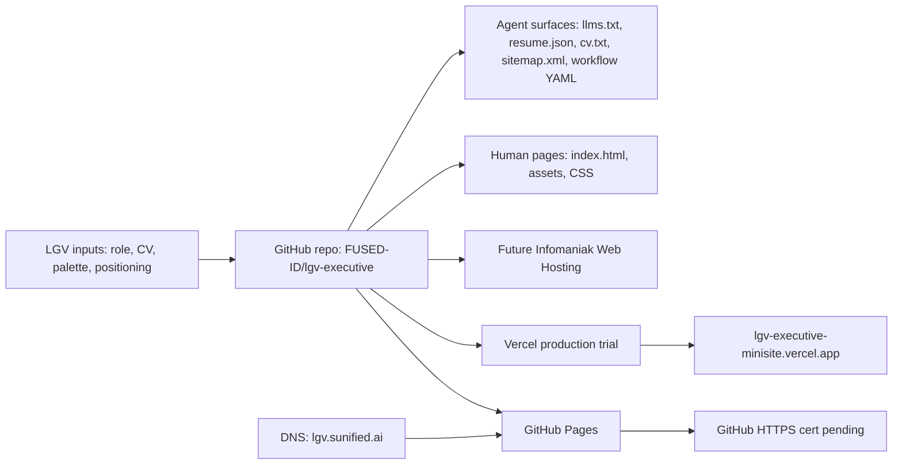

# LGV Executive Campaign Site Work Report

Date: 2026-06-28
Owner: Codex with LGV
Repository: `https://github.com/FUSED-ID/lgv-executive`

## Executive Summary

Built and shipped the first source-controlled executive campaign microsite for Leon Gerard Vandenberg, focused on Siemens Energy and broader Fortune 500 renewable energy / digital grid leadership positioning.

The site is now live on Vercel as a working HTTPS trial, remains deployed on GitHub Pages, and keeps `lgv.sunified.ai` pointed at GitHub Pages for now while GitHub's custom-domain certificate provisioning catches up.

## Current Live Surfaces

| Surface | URL | Status | Notes |
|---|---|---|---|
| Vercel production trial | `https://lgv-executive-minisite.vercel.app/` | Ready | HTTPS working, agent endpoints smoke-tested. |
| GitHub Pages | `http://lgv.sunified.ai/` | Built | DNS points here; HTTPS cert still not issued by GitHub. |
| GitHub source | `https://github.com/FUSED-ID/lgv-executive` | Active | Source of truth for current static site. |
| Local source | `outputs/lgv-executive-minisite/` | Active | Working copy on M4. |

## User Inputs

- Target role: Siemens Energy senior leadership mandate in Munich.
- Primary audience: retained executive recruiter / hiring committee / agentic research tools.
- Brand requirements:
  - Use Inter only.
  - Online site can use dark teal.
  - CV/PDF should be off-white and easy to read.
  - Use Sunified investor deck palette.
- Campaign email: `lgv@sunified.ai`.
- Keep Sunified on the front foot.
- Positioning frame:
  - AI-first executive.
  - 29 years trusted edge / wireless / identity / fintech / platform work.
  - 8 years renewables / solar / storage / grid data.
  - gBrain / agentic tooling / OpenExO / Creative Destruction framing.
- Hosting exploration:
  - GitHub Pages first.
  - Infomaniak as strategic Swiss/sovereign host.
  - Vercel as agent-ready host.
  - Replit / GoDaddy considered but lower priority.

## Outputs Created

### Human-Facing

- `index.html` - one-page executive microsite.
- `styles.css` - responsive visual system.
- `assets/grid-hero.png` - energy/grid hero visual.
- `assets/leon-gerard-vandenberg.jpg` - executive portrait asset.

### Agent-Facing

- `llms.txt` - LLM orientation file.
- `resume.json` - JSON Resume structured profile.
- `cv.txt` - plain-text CV/profile extraction.
- `robots.txt` - crawler permission and sitemap pointer.
- `sitemap.xml` - canonical machine traversal map.
- `campaign-workflow.yaml` - first campaign harness capture.

### Hosting / Ops

- `CNAME` - GitHub Pages custom-domain file for `lgv.sunified.ai`.
- `vercel.json` - Vercel static hosting config:
  - clean URLs.
  - content-type headers for agent-readable files.
  - basic security headers.
- `.gitignore` - excludes local `.vercel` project metadata.

## Systems Design



## Current Hosting Settings

### GitHub Pages

- Repo: `FUSED-ID/lgv-executive`
- Branch/path: `main` / `/`
- CNAME: `lgv.sunified.ai`
- Status: `built`
- HTTPS enforcement: `false`
- Blocker: GitHub still reports certificate does not exist yet.

### DNS

Current `lgv.sunified.ai` CNAME:

```txt
lgv.sunified.ai -> fused-id.github.io
```

This is intentionally unchanged overnight so we can see whether GitHub completes certificate provisioning.

### Vercel

- CLI installed on M4 and M1 via Homebrew: `vercel-cli 54.18.0`
- Project: `lgv-executive-minisite`
- GitHub integration: connected to `https://github.com/FUSED-ID/lgv-executive`
- Production alias: `https://lgv-executive-minisite.vercel.app/`
- Deployment status: Ready
- Agent endpoint smoke test: all `200`

Verified endpoints on Vercel:

```txt
/                         200 text/html
/resume.json              200 application/json
/cv.txt                   200 text/plain
/llms.txt                 200 text/plain
/robots.txt               200 text/plain
/sitemap.xml              200 application/xml
/campaign-workflow.yaml   200 text/yaml
```

## Design Decisions

1. Keep the first screen as an actual executive microsite, not a landing-page explainer.
2. Use a dark teal online visual mode, but reserve off-white for printed CV/PDF readability.
3. Use Inter only.
4. Add a real portrait, but keep it subtle and hide it on mobile.
5. Keep agent-readable resources explicit and crawlable.
6. Use GitHub as source of truth regardless of hosting provider.
7. Leave DNS pointed at GitHub overnight to see if GitHub certificate issuance resolves.
8. Keep Vercel as the fast, working HTTPS fallback and likely production candidate if GitHub cert remains stuck.

## Best-of-Breed Assessment

| Option | Role | Decision |
|---|---|---|
| GitHub Pages | Source-controlled static host | Keep as current custom-domain target overnight. |
| Vercel | Agent-ready deployment platform | Strong technical favorite; already live with HTTPS. |
| Infomaniak | Swiss/sovereign brand-aligned production | Strong strategic favorite for final canonical hosting if desired. |
| GoDaddy Hosting | Commodity hosting | Avoid unless convenience wins. |
| Replit | Fast prototyping | Useful for experiments, not canonical executive site. |

## Tomorrow Plan

1. Check GitHub Pages certificate state:
   - If certificate exists, enable HTTPS on GitHub Pages and test `https://lgv.sunified.ai`.
   - If still pending/stuck, move custom domain to Vercel or proceed with Infomaniak.
2. Decide canonical production host:
   - `lgv.sunified.ai` on GitHub Pages if cert clears.
   - `lgv.sunified.ai` on Vercel if speed/agent readiness wins.
   - `lgv.sunified.ai` on Infomaniak if sovereignty/brand story wins.
3. Add `lgv.sunified.ai` to the chosen host and update DNS.
4. Update LinkedIn Featured link once canonical HTTPS is stable.
5. Review and optionally send Angela response with CV + site link.
6. Consider adding a lightweight contact intake route:
   - `mailto:lgv@sunified.ai` now.
   - Vercel serverless form or Infomaniak form later only if needed.

## Open Risks

- GitHub custom-domain certificate delay may persist.
- `sunified.ai` HSTS means browsers will reject bad HTTPS and will not fall back to HTTP.
- Vercel custom-domain move requires changing DNS away from GitHub Pages.
- Infomaniak hosting requires account/product setup and deploy credentials.
- Do not commit `.vercel/project.json`.

## Verification Completed

- Local page opened in Atlas side panel.
- Local page opened in Brave and Safari.
- Vercel deploy inspected and ready.
- Vercel endpoints smoke-tested.
- GitHub Pages inspected and built.
- DNS verified as still pointing to GitHub Pages.
- Vercel CLI installed and checked on both M4 and M1.
